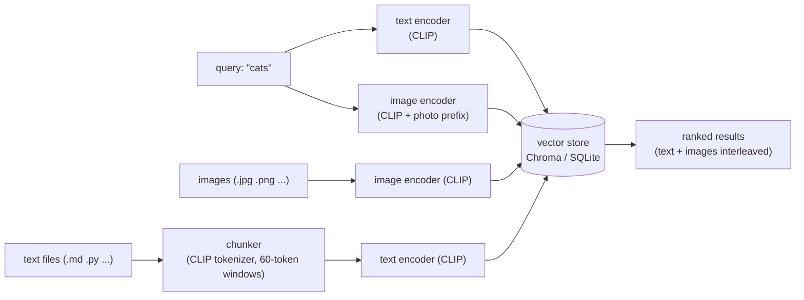

# glance


> Type `cat`. Get back your notes on feline behavior *and* the photo of your kitten — ranked together.

**glance** is a cross-modal semantic search CLI for your personal files. It indexes images and text documents into the same embedding space using CLIP, so a single natural-language query searches both at once — no tagging, no metadata, no folders. Just meaning.

---

## Table of Contents

- [For Graders](#for-graders)
- [Installation](#installation)
- [Quick Start](#quick-start)
- [Usage](#usage)
  - [Interactive TUI](#interactive-tui)
  - [CLI Commands](#cli-commands)
- [How It Works](#how-it-works)
- [Platform Notes](#platform-notes)
- [Known Limitations](#known-limitations)

---

## For Graders

> [!IMPORTANT]
> **Start here.** Sample files (5 images + 5 text documents) are bundled in the repo under `tests/fixtures/`. You do not need to find your own assets. The fastest path to a working demo is below.

**Option A — local macOS or Linux (recommended, fastest)**

```bash
# 1. install glance
uv add "git+https://github.com/subika-haider/glance.git"

# 2. clone the repo to get the bundled fixtures
git clone https://github.com/subika-haider/glance.git glance-repo

# 3. index the fixtures (first run downloads CLIP model, ~338 MB)
glance add glance-repo/tests/fixtures/

# 4. try some searches
glance search "cats"
glance search "ocean"
glance search "mountain" --type image
glance search "dogs" --type text

# 5. launch the interactive TUI
glance
```

**Option B — fully isolated Docker container (Linux, heavier download)**

```bash
docker run --rm -it python:3.11-slim bash -c "
  apt-get update -qq && apt-get install -y --no-install-recommends git &&
  pip install uv --quiet &&
  mkdir /test && cd /test && uv init --quiet &&
  uv add 'git+https://github.com/subika-haider/glance.git' &&
  git clone https://github.com/subika-haider/glance.git fixtures &&
  uv run glance add fixtures/tests/fixtures/ &&
  uv run glance search cats &&
  uv run glance search ocean &&
  uv run glance status
"
```

> [!CAUTION]
> The Docker path downloads PyTorch with full CUDA/NVIDIA libraries (~2 GB of wheels: `nvidia-cublas`, `nvidia-cudnn`, `nvidia-nccl`, `nvidia-cusolver`, `triton`, etc.) plus the CLIP model (~338 MB) — **~2.4 GB total**. This is a Linux-only artifact of how PyTorch is packaged; macOS installs are much lighter (~500 MB). Plan accordingly if on a metered connection.

**What to verify:**
- `glance --help` lists all six commands (add, search, ls, rm, status, clear)
- `glance add <path>` indexes files and reports counts
- `glance search "cats"` returns both `cat.jpg` and `cats.md` in results
- `glance status` shows storage path, image/text counts, and model name
- `glance` (no args) launches the interactive TUI

---

## Installation

**Prerequisites:** Python 3.10+, [`uv`](https://docs.astral.sh/uv/getting-started/installation/)

```bash
uv add "git+https://github.com/subika-haider/glance.git"
```

> [!NOTE]
> **Dependency size:** `uv add` installs PyTorch and its dependencies. On Linux this includes NVIDIA CUDA libraries (`nvidia-cublas`, `nvidia-cudnn`, `nvidia-nccl`, `nvidia-cusolver`, `triton`, and more) even for CPU-only use — expect ~2 GB of wheel downloads. On macOS the CPU-only torch wheel is used and the install is significantly lighter (~500 MB).

> [!NOTE]
> **Model download:** The first time you run `glance add` or launch the TUI, glance downloads the CLIP model (~338 MB) from HuggingFace. This is a one-time download cached in `~/.cache/huggingface/`. Subsequent runs load from cache instantly.

---

## Quick Start

Sample files are bundled in the repo under `tests/fixtures/` — five images (beach, car, cat, dog, mountain) and five matching text files. Clone the repo and use them to try glance immediately without finding your own assets.

```bash
# clone the repo to get the sample files
git clone https://github.com/subika-haider/glance.git
cd glance

# index the sample files (triggers model download on first run)
glance add tests/fixtures/

# search across images and text at once
glance search "cats"
glance search "ocean waves"
glance search "vehicle"
```

Expected output for `glance search "cats"`:

```
#   Path                                           Type   Score
1   tests/fixtures/text/cats.md                    text   0.81
    > Domestic cats (Felis catus) are small carnivorous mammals...
2   tests/fixtures/images/cat.jpg                  image  0.29
3   tests/fixtures/text/dogs.md                    text   0.54
    > Dogs (Canis lupus familiaris) are domesticated mammals...
```

---

## Usage

### Interactive TUI

Run `glance` with no arguments to launch the full-screen terminal interface:

```bash
glance
```

The TUI loads the model in a background thread behind a loading screen, then drops you into live search mode — results update as you type.

**Modes** — press <kbd>Tab</kbd> to cycle through:

| Mode | What it does |
|------|-------------|
| `search` | Live semantic search; results update as you type |
| `list` | Browse everything currently indexed |
| `add` | Type a path and press <kbd>Enter</kbd> to index it |
| `status` | Storage location, item counts, model name |

**Keybindings:**

| Key | Action |
|-----|--------|
| <kbd>Tab</kbd> | Cycle modes |
| <kbd>Enter</kbd> | Lock focus to results (search) / submit path (add) |
| <kbd>o</kbd> | Open selected file with the system default app |
| <kbd>c</kbd> | Copy selected file's path to clipboard |
| <kbd>r</kbd> | Remove selected item from the index (with confirmation) |
| <kbd>i</kbd> | Filter results to images only |
| <kbd>t</kbd> | Filter results to text only |
| <kbd>a</kbd> | Show all types |
| <kbd>Esc</kbd> | Return focus to the search input |
| <kbd>q</kbd> | Quit |

---

### CLI Commands

Every command is also available as a direct CLI subcommand.

#### `glance add <path>`

Index a file, folder, or glob. Folders are traversed recursively.

```bash
glance add ~/Pictures/
glance add ~/Documents/notes/
glance add tests/fixtures/          # index the sample files
glance add report.pdf               # PDFs are skipped with a warning
glance add ~/code/ --text-ext .rst  # add .rst as an extra text extension
glance add ~/code/ --no-skip-defaults  # include hidden files and caches
```

Re-indexing the same file is safe — glance uses content-based IDs and upserts, so it never creates duplicates.

Skipped by default: hidden files (dotfiles), `node_modules/`, `.git/`, `__pycache__/`, `.venv/`

**File size limits:** 10 MB per image, 1 MB per text file. Larger files are skipped with a warning.

**Supported types:**

| Category | Extensions |
|----------|-----------|
| Images | `.jpg` `.jpeg` `.png` `.webp` `.gif` |
| Text | `.txt` `.md` `.py` `.json` `.csv` |
| Skipped | PDFs, videos, audio, binaries (with a warning) |

---

#### `glance search <query>`

Search across all indexed files with a natural-language query.

```bash
glance search "cats"
glance search "mountain landscape"  --type image   # images only
glance search "feline behavior"     --type text    # text only
glance search "dogs"                -n 5           # top 5 results
glance search "ocean"               --no-score     # hide score column
glance search "car"                 --min-image-score 0.18  # lower CLIP threshold
```

Results are returned as a ranked table with path, type, score, and a text snippet for text matches. When a text file matches via multiple chunks, the best-matching chunk is shown with a `+N more` annotation.

> [!TIP]
> glance is optimized for short, single-concept queries. `cat`, `mountain`, `ocean waves` work great. Long multi-concept sentences like "red ball on blue chair near a window" will underperform — CLIP's text encoder truncates at 77 tokens and is not compositionally precise.

---

#### `glance ls`

List all indexed items.

```bash
glance ls                    # all items
glance ls --type image       # images only
glance ls --type text        # text only
```

---

#### `glance rm <path>`

Remove items matching a path from the index (prompts for confirmation).

```bash
glance rm ~/Pictures/old-photo.jpg
glance rm ~/Documents/notes/draft.md
```

---

#### `glance status`

Show index stats without loading the model.

```bash
glance status
```

```
storage     /Users/you/.local/share/glance
images      5
text        12
model       clip-ViT-B-32
```

---

#### `glance clear`

Drop the entire index. Prompts for confirmation unless `--yes` is passed.

```bash
glance clear
glance clear --yes    # skip confirmation
```

---

## How It Works

glance uses [CLIP](https://openai.com/research/clip) (Contrastive Language–Image Pretraining) to embed both text and images into the same 512-dimensional vector space. Because both modalities live in the same space, a text query can retrieve images by semantic similarity — not keyword matching, not file metadata.



**Two queries per search:** For a given query string, glance encodes it twice — once as-is (for text retrieval) and once as `"a photo of a {query}"` (for image retrieval). This is a standard CLIP trick that closes the modality gap: CLIP was trained on image captions, so the photo-prefix dramatically improves text-to-image similarity scores and prevents text results from drowning out images in a mixed ranking.

**Index storage:** `~/.local/share/glance/` — a single Chroma collection backed by SQLite. Survives reinstalls and upgrades.

---

## Platform Notes

> [!WARNING]
> **Windows is not supported.** glance is designed and tested on macOS and Linux. On Windows, use [WSL](https://learn.microsoft.com/en-us/windows/wsl/) or a Docker container. The CLI will emit a warning if run on Windows, and the TUI will display a modal before launching.

**macOS / Linux:** Fully supported. The `glance` command is available after `uv add`.

**Docker (clean-room test):**

```bash
docker run --rm -it python:3.11-slim bash -c "
  apt-get update -qq && apt-get install -y --no-install-recommends git &&
  pip install uv --quiet &&
  mkdir /test && cd /test && uv init --quiet &&
  uv add 'git+https://github.com/subika-haider/glance.git' &&
  uv run glance --help
"
```

---

## Known Limitations

<details>
<summary>Click to expand</summary>

**77-token CLIP text limit.** CLIP's text encoder hard-truncates at 77 tokens. Long queries get silently truncated. The tool is optimized for single words and short phrases; glance chunks text files using the CLIP tokenizer to work around this, but query length still matters.

**Weak compositional reasoning.** CLIP processes text as a bag of concepts, not as structured language. Queries like `"red ball on blue chair"` perform poorly — it conflates both concepts. Single-concept queries (`"red ball"`, `"mountain"`) work reliably.

**CLIP modality gap.** Text-to-text cosine similarity in CLIP sits at 0.7–0.9 for good matches; text-to-image sits at 0.2–0.4. These are on completely different scales. glance handles this by interleaving results by rank rather than raw score, and by using a lower score floor for images (`--min-image-score`, default 0.22).

**CPU inference only.** Model runs on CPU. Typical throughput is 0.5–2 seconds per image on a laptop. Suitable for personal libraries up to a few thousand items. Not designed for 100K+ item collections.

**First-run model download.** ~338 MB (CLIP). Subsequent runs load from the HuggingFace cache instantly.

**Niche concepts.** CLIP knows mainstream visual concepts well. Scientific diagrams, domain-specific jargon, and obscure categories perform poorly.

**No PDF support.** PDFs are explicitly out of scope and are skipped with a warning. Use a separate tool to convert PDFs to `.txt` first.

**Index size.** Optimized for ≤ 5,000 items. Functional up to ~20,000; indexing time and disk usage grow proportionally.

</details>
